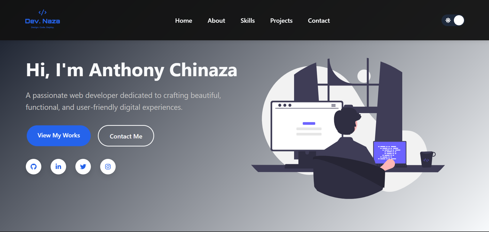

# DevNaza Portfolio

This is a modern, responsive developer portfolio built with React and Vite. It showcases skills, projects, and contact information in a clean, visually appealing layout.

## Features

- **Responsive Design:** Looks great on all devices.
- **Component-Based:** Modular React components for easy maintenance.
- **Dark/Light Theme Toggle:** Switch between light and dark modes.
- **Project Showcase:** Displays projects with images and descriptions.
- **Skills Section:** Categorized frontend, backend, and tools skills.
- **Contact Form:** Simple form for visitors to reach out.

## Demo



[View Live Demo](https://devnaza.netlify.app/)

## Getting Started

### Prerequisites

- [Node.js](https://nodejs.org/) (v16 or higher recommended)
- [npm](https://www.npmjs.com/) or [yarn](https://yarnpkg.com/)

### Installation

1. **Clone the repository:**
   ```sh
   git clone https://github.com/codimaniac/devnaza.git
   cd dev-naza
   ```
2. **Install dependencies:**
   ```sh
   npm install
   # or
   yarn install
   ```
3. **Start the development server:**
   ```sh
   npm run dev
   # or
   yarn dev
   ```
4. Open [http://localhost:5173](http://localhost:5173) to view it in your browser.

## Project Structure

```
src/
  components/      # Main layout and section components
  ui/              # UI elements (buttons, cards, toggles, etc.)
  assets/          # Images and static assets
  App.jsx          # Main app component
  main.jsx         # Entry point
public/
  images/          # Public images
```

## Customization

- Update your information, skills, and projects in the respective components and JSON files in `src/components/` and `src/ui/`.
- Replace images in `public/images/` and `src/assets/images/` as needed.

## Deployment

To build for production:

```sh
npm run build
# or
yarn build
```

The output will be in the `dist/` folder. Deploy the contents of `dist/` to your preferred hosting service (e.g., Vercel, Netlify, GitHub Pages).

## License

This project is licensed under the MIT License.

---

Made with ❤️ by [codimaniac](https://github.com/codimaniac)
